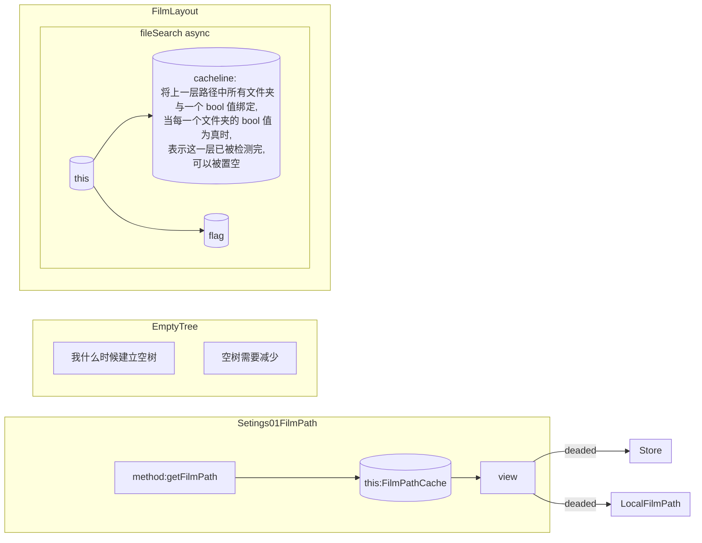

<!--
 * @Author: your name
 * @Date: 2020-05-04 02:40:16
 * @LastEditTime: 2020-05-04 03:13:04
 * @LastEditors: Please set LastEditors
 * @Description: In User Settings Edit
 * @FilePath: \undefinedh:\ElectronProject\Electron_Vue\writer5\log\Setings01FilmPath.md
 -->
## 架构


- fileSearch
  - 我有一个根路径，
    - 遍历并记录它的下一层的子目录 1
      - 先分离出文件与目录 2
        - 文件再分出视频文件与非视频文件 2.1
      - 将视频文件添加到树上 3
      - 将子目录保存到一个缓存数组中 4
      - 将子目录添加到树上 5
    - 开始对子目录中所有的进行递归，查找子目录的子目录，并重复 1 2 3 4 5 当这一层（理想是这个已经在检测第二层）
      - 检测完后，
      - 将由上一层得到的缓存数组置空
    1. 使用await 去 将传入的第一层子路径获取 <span style="float:right"></span>
    ```js
      const files = await this.fsReadDir(dirPath); //查找到每一个传入路径的子路径的文件名
    ```
    2. 使用forEach 将这一层的中所有文件、文件夹中的视频文件全部添加到树中
    ```js
      files.forEach((item, index) => {
        //将每一个文件转成子路径，判断它是否是文件,并且它是否还是视频文件， 
        //都为真：什么都不做
        //假：表示它是目录，添加到树中
        fs.statSync(path.join(dirPath, item)).isFile() &&
          !this.getFileType(item) ? console.log() : Tree.add(path.join(dirPath, item), dirPath, Tree.traverseBF);
      });
    ```
    3. 对已经产生了包含所有路径数组，进行每一个路径的使用fs.stat 获取路径信息，返回一个这层路径所有的 promise
    ```js
      const promises = files.map(file => {
        return this.fsStat(path.join(dirPath, file));
      });
    ```
    4. 将包含这层所有路径的 promise 对象 通过 Promise.all 去把这个对象和它的路径对应起来，组成一个这个文件的全路径与它的 Promise 对象的对象数组
    ```js
      const datas = await Promise.all(promises).then(stats => {
        for (let i = 0; i < files.length; i++) {
          files[i] = path.join(dirPath, files[i]);
        }
        return {
          stats,
          files
        };
      });
    ```
       - datas 为一个 stats对象（文件的信息，如是否是目录还是文件）与一个文件路径对应组成一个数组

    5. 对这一层即将要被去检测是否是路径，还是文件的，当有文件夹存在时，就表示将下一次对这一层所有存在的文件夹数量的递归，并将这个路径与一个 bool 值 组成一个对象 保存成一个对象数组，这个 bool 用来决定这个路径是否完成，当数组中的所有对象的路径的 bool 为 true 后 才能执行下一步的操作。
    ```js
      datas.stats.forEach(stat => {
        if (stat.isDirectory()) {
          //这个目录有文件 则还需要递归
          let data = {};
          data.dir = datas.files[datas.stats.indexOf(stat)];
          data.state = false;
          this.cacheline.push(data);
        }
      });
    ```
    6. 当保存了下一层要递归的文件夹数量，与路径，当这个数量不为零时，对这个缓存的文件夹数组 

    ```js
          if (this.checkline[index].indexOf(dirPath)) {
            this.checkline[index].find(value => {
              //  console.log(value);
              if (value.dir == dirPath) {
                value.state = true;
              }
            });
     ```
